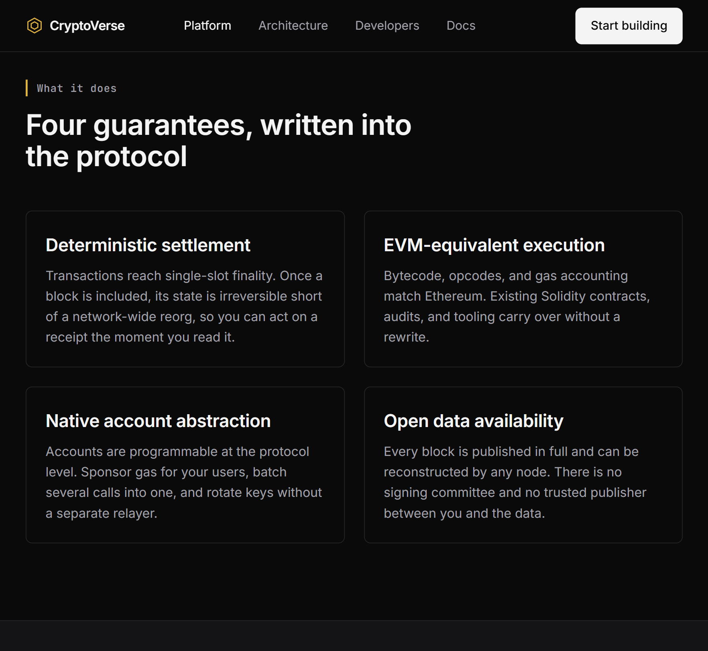
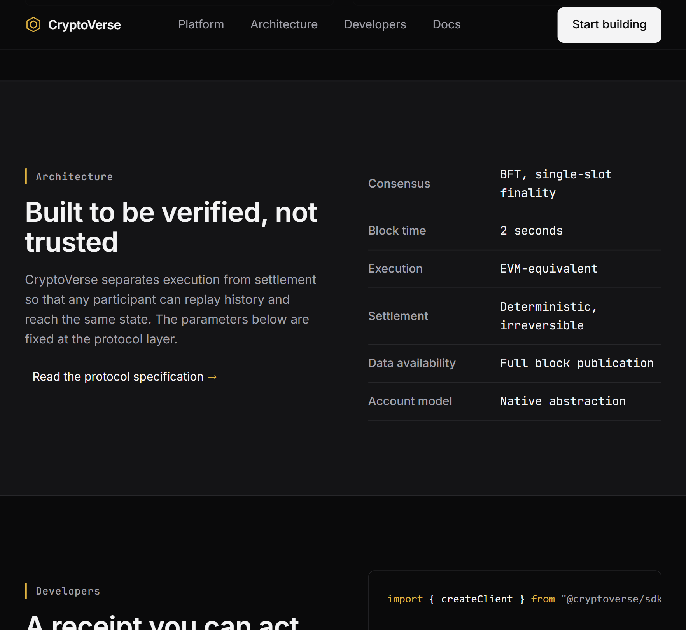
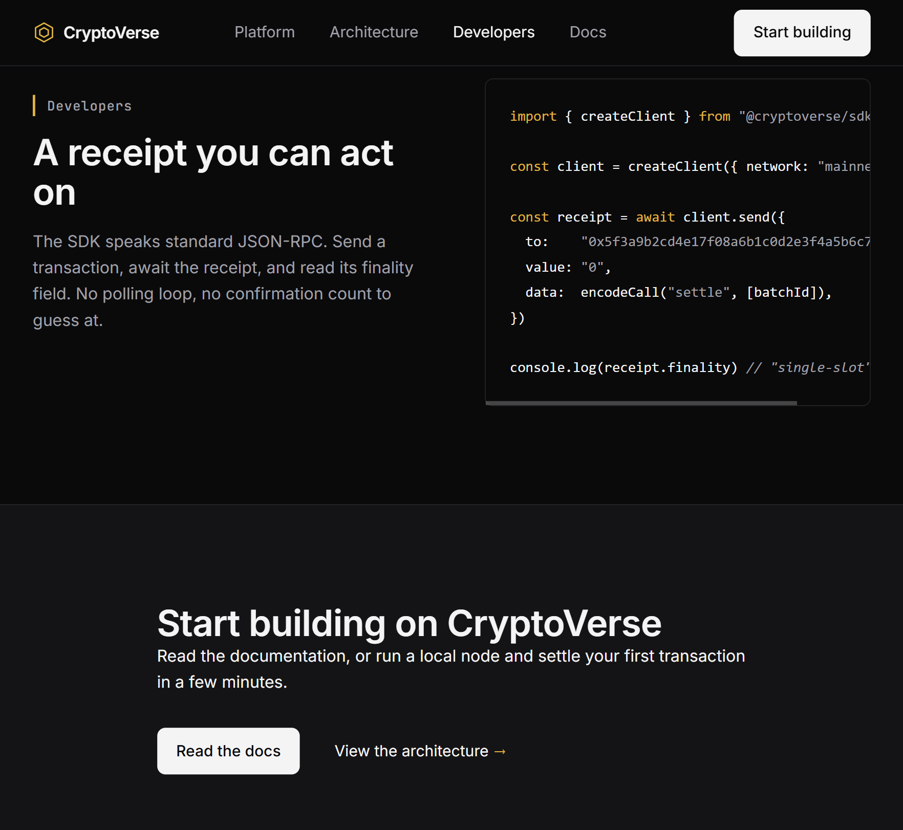
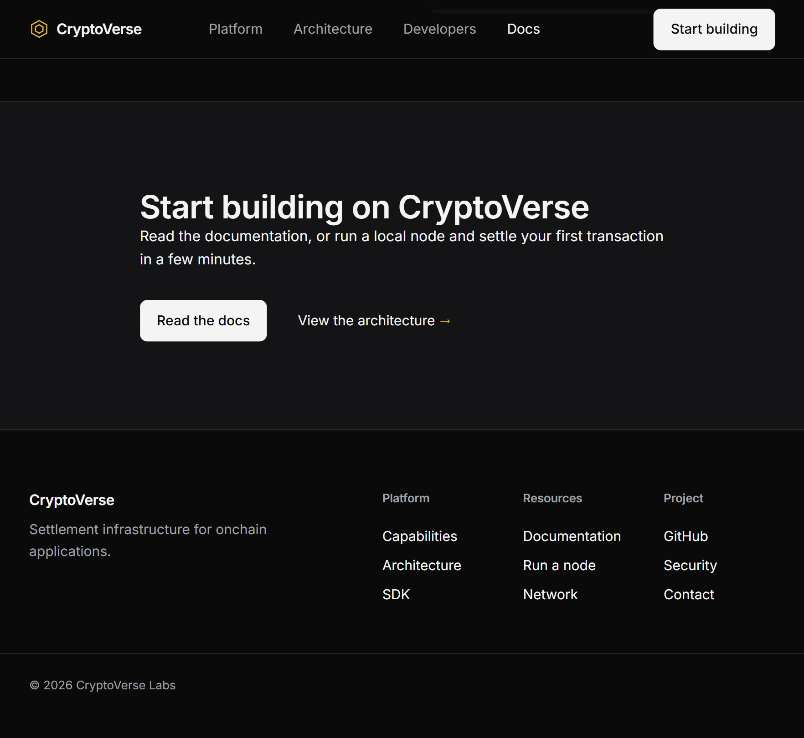

# web-design-enhancer-pro

**Eliminates AI bad habits in web design — and enforces beauty.**  
Stateful, evidence-driven quality orchestrator for AI coding agents (V3) + battle-tested anti-slop / craft gates (V2 arsenal).

> **The model proposes and implements. The orchestrator authorizes, verifies, and blocks.**

**Version:** `3.0.0a1` · Tag: [`v3.0.0a1`](https://github.com/Steph-ux/web-design-enhancer/releases) · V2 freeze: `v2.2.0`

---

## Install & CLI

```bash
cd web-design-enhancer-pro
pip install -e .          # installs the `wde` command
wde --help
wde --version             # → 3.0.0a1
```

| Form | Use when |
|------|----------|
| **`wde …`** | After install (recommended) |
| **`python -m wde …`** | Package importable, no console script on PATH |
| **`python wde.py …`** | Repo root, local launcher |

There is no need for `python -m wde.cli.main`.

### Quickstart

```bash
wde init --root <project>
wde status --json --root <project>
wde next --root <project>

# contracts (follow next_action only)
wde validate intent --root <project>
wde validate experience --root <project>
wde validate design --root <project>
wde validate lock --root <project>

# checks + delivery
wde run static --root <project>
wde deliver-check --root <project>
wde review --emit-package --url http://localhost:5173 --root <project>
# independent judge → audit-results/aesthetic-verdict.json  (never self for delivery)
wde review --url http://localhost:5173 --root <project>
wde report --root <project>
wde benchmark --corpus    # never auto-delivers
```

| Piece | Role |
|-------|------|
| `.wde/state.json` | Phase machine — **wde-core only** (agents must not hand-edit) |
| `.wde/evidence/*` | Hashed envelopes — models must not write `status=passed` |
| `wde next` | Only authorized next command |
| Adapters | [`adapters/generic`](adapters/generic/ADAPTER.md), [`claude-code`](adapters/claude-code/ADAPTER.md), [`codex`](adapters/codex/ADAPTER.md) |
| Skill | Thin [`SKILL.md`](SKILL.md) → drive the CLI, do not invent gates |
| Docs | [`docs/V3.md`](docs/V3.md) · plan [`docs/superpowers/specs/2026-07-10-wde-v3-plan.md`](docs/superpowers/specs/2026-07-10-wde-v3-plan.md) |

V2 `scripts/*` remain the **check implementations**. Prefer `wde run` / `wde deliver-check` so hashes, invalidation, and evidence stay consistent.

---

## What it does

By default, every AI generates the same website: dark hero + blue→purple gradient + 3-column card grid + testimonials + blue CTA. This project makes that **impossible to deliver as “ready”** without fresh proof.

It forces the agent to:

1. **State intent** in a Creative Brief (POV a model cannot invent for you)
2. **Lock a design contract** (`DESIGN.md` + structural lock) before free coding
3. **Pass mechanical gates** (anti-slop, spacing, a11y, uniqueness, beauty, gestures, layout, …)
4. **See the live page** via **Eyes (Playwright MCP)** — vision **and** mechanical capture, not either alone
5. **Prove delivery** with evidence envelopes — not a chat claim of “gate passed”

Anti-template gates penalise generic slop; Beauty / WOW reward craft; Eyes judges whether the render reads as human-made, fluid, and working.

---

## Usage — what you do

You do **one** thing the system cannot do for you: write a short **Creative Brief** (`CREATIVE-BRIEF.md`) — emotional intent, one unexpected bet, one hero dimension, a broken rule *with because*, Design Read, Design Dials, and a non-software Cross-Domain Steal.

Then use the agent normally:

```text
Create a website for my premium cosmetics agency
```

The skill/CLI path forces style selection, contract locks, implementation under lock, then Eyes + `deliver-check`. If it still looks like the generic template, delivery stays blocked.

**Everything after the brief is orchestrated.** You set intent; WDE enforces craft and proof.

### Agent skill entry

Load [`SKILL.md`](SKILL.md) (or install under `~/.claude/skills/web-design-enhancer-pro`). The skill is a **thin adapter**: always run `wde status` / `wde next` and follow only `next_action`.

Legacy progressive workflows still live under [`references/workflows/`](references/workflows/) for craft depth; V3 agents should not invent a parallel gate map.

---

## Same brief, different styles

A “personal finance app” brief yields different results by archetype:

| Archetype | Output | Looks like |
|---|---|---|
| *(without WDE — AI default)* | Dark + blue-500 + gradient + 3 columns | Identical to 1000 other fintechs |
| **§6 Technical/Monochrome** | Zinc/monochrome, dense, tabular numbers | Linear, Vercel |
| **§3 Luxury/Restrained** | Ivory, thin typography, 0 bright colors | Private practice, Aesop |
| **§8 Data/Dashboard** | Dark background, semantic colors, charts first | Clean Grafana, Amplitude |

### Rendering example: NOIRÉ (§3 Luxury/Restrained)

End-to-end cosmetics house — onyx, Fraunces + Inter, champagne accent, signature hairline. Hard gates cleared (slop **99/100**, beauty **96/100**, composition **74/100** on rendered DOM):


---

## The 10 archetypes

| # | Name | For which project |
|---|---|---|
| §1 | Swiss/Typographic | Agency, culture, print-to-web |
| §2 | Editorial/Magazine | Media, premium blog, newspaper |
| §3 | Luxury/Restrained | Fashion, cosmetics, premium B2C |
| §4 | Brutalist/Raw | Art, niches, cultural, avant-garde |
| §5 | Organic/Hand-crafted | Wellness, artisan, food, nature |
| §6 | Technical/Monochrome | Dev SaaS, API, CLI, B2B tools |
| §7 | Playful/Expressive | Consumer app, education, community |
| §8 | Data/Dashboard | Analytics, monitoring, BI, fintech |
| §9 | Retro/Nostalgic | Gaming, niche, culture, experimental |
| §10 | Material/Tactile | OS app, design system, productivity |

→ Full details: [`references/design-archetypes.md`](references/design-archetypes.md)

### Web3 / crypto

No dedicated crypto archetype. Serious web3 (L2, wallet, protocol) → **§6 Technical/Monochrome**. The usual “crypto wow” (glow, blue→purple mesh, glass) **is** the AI-slop palette and is blocked. Legitimate wow is real 3D (`three.js`), disciplined motion (`gsap`), or oversized type — rewarded by `audit_wow.py`. Crypto-copy tells (staccato taglines, WAGMI, “the future of finance”) are flagged by `detect_ai_slop.py`.

### Rendering example: CryptoVerse (§6, web3)

Zinc monochrome, amber accent, real three.js lattice — opposite of the token-launch template. Slop **96/100** / design **PASS**; a deliberate slop variant is **BLOCKED**.










---

## Example prompts

Vague briefs collapse to the SaaS default. POV briefs force memorable work.

| Brief | What you get |
|---|---|
| `Create a developer portfolio with a modern, professional design` | Dark hero, blue→purple gradient, 3-column card grid |
| `…as if Dieter Rams worked in 2026… typography IS the interface… two colours… hero name 140px…` | Something outside the default distribution |

Ready-to-use prompts (feeling + unexpected move + hero dimension + getdesign anchor):

```text
# Editorial — §2, anchor: wired
Build a long-form tech journalism site. Printed broadsheet on a screen —
ink-dense, custom serif display, mono kickers. Unexpected: no hero image;
opening is a 96px pull-quote. Hero dimension: typography. Anchor: wired.
```

```text
# Finance dashboard — §6, anchor: linear.app
Budgeting UI as a precision instrument. Zinc monochrome, tabular figures.
Unexpected: only colour is semantic green on positive balance. Hero: negative space.
```

```text
# Wellness — §5, anchor: clay
Spa booking like warm stone at dawn. Hand-drawn asymmetry, paper texture.
Unexpected: calendar as horizontal sun-path, not a grid. No soft gradients.
```

```text
# Indie game — §9, anchor: nintendo-2001
Roguelike landing as Y2K console boot. Unexpected: cartridge-select carousel nav.
Hero dimension: motion.
```

```text
# Football club — §7, anchor: nike
Tunnel-walk energy. Unexpected: match scores in 120px condensed type as hero.
```

```text
# Luxury cosmetics — §3, anchor: ferrari (cinematic restraint)
Private atelier at closing. Unexpected: single-column product scroll, one product per viewport.
```

```text
# Web3 L2 — §6, anchor: linear.app
Precision infrastructure, not token launch. Unexpected: live three.js batch tree —
nothing glows. No “Decentralized. Trustless. Permissionless.”
```

---

## Validation map

### V3 (preferred)

Drive everything through the CLI so evidence is real:

```bash
wde validate intent|experience|design|lock
wde run static|mechanical|browser|full --url <url>
wde deliver-check
wde review --emit-package --url <url>
wde review --url <url>
wde report
```

Domains (forms / states / i18n / perf / maintainability) run via the check registry (`domains.bundle`). Benchmark: `wde benchmark` (smoke) or `wde benchmark --corpus` (12 tasks) — **never auto-delivers**.

### V2 gate map (implementations under `scripts/`)

Canonical order: [`references/workflows/04-gates.md`](references/workflows/04-gates.md).

| ID | Tool | Blocking |
|----|------|----------|
| **G0** | Phase 0 + brief + sources | yes |
| **G1** | `validate_design` + hash | yes |
| **G2** | structural-lock | yes |
| **F1** | `detect_ai_slop` | yes |
| **F1b** | `audit_declared_antipatterns` | yes |
| **F2** | `audit_spacing` | yes |
| **F3** | `validate_design` final | yes |
| **F4** | `diff_design_vs_code` | yes if `--code` |
| **F5** | `audit_accessibility` | yes |
| **F6** | `audit_style_uniqueness` | block if score > 65 |
| **F7** | `audit_beauty` | block if score < 50 |
| **F8** | `audit_gestures` | yes if < 2/3 gestures |
| **F9** | visual report + aesthetic verdict | floor 62 / **pass 80** + full dims; self cannot authorize; `independent-clone` is declared-only |
| **F10** | `audit_layout` | L1–L3 block when `--url` |
| **Eyes** | Playwright MCP rubric | skill-level mandatory |
| **WOW** | `audit_wow` | when `--wow` |

Direct script use (legacy / debug only):

```bash
python scripts/check.py --gate 0
python scripts/check.py --final --code ./src --url http://localhost:3000
python scripts/check.py --final --code ./src --url http://localhost:3000 --wow
```

---

## Eyes (Playwright MCP) — mandatory before delivery

**Eyes is part of the definition of done** for any UI create/change. **MCP + mechanical (AND)** — “looks fine in the JSX” is not Eyes.

| Path | Role |
|------|------|
| **Playwright MCP** | Navigate, resize, screenshot, snapshot, fluidity/console |
| `visual_audit.py` | Multi-breakpoint capture → `audit-results/audit_report.json` |
| `audit_layout.py` | Overflow / grid integrity when `--url` |
| `aesthetic_review.py` / agent verdict | Non-self `aesthetic-verdict.json` |
| `eyes_checklist.py` | Minimum Eyes artifacts present |
| `audit_mobile.py` | Native mobile hard-blocks (targets < 44pt, safe-area) |

Protocol: [`references/vision-playwright.md`](references/vision-playwright.md) · craft: [`beauty-gestures.md`](references/beauty-gestures.md) · [`mobile-beauty.md`](references/mobile-beauty.md)

In V3, prefer `wde review` + independent verdict + `wde deliver-check`. If MCP is unavailable, `degraded_mode` must be explicit — never fake Eyes.

---

## Forbidden patterns (selection)

| Code | Pattern | Forbidden example |
|---|---|---|
| G1 | System badges | `SYS_STATUS: ONLINE` |
| G7 | Unrequested animations | `@keyframes float` |
| A1 | Emojis in the UI | `✨ Our features` |
| A3 | Invented “trusted by” | Fictional logos |
| A4 | Hardcoded testimonials | Fake “Sarah, CEO” |
| B7 | Blue→purple hero gradient | `linear-gradient(… #3B82F6, #8B5CF6)` |
| B8 | Glassmorphism everywhere | `backdrop-filter` on 3+ elements |
| C7 | `font-size` in px on `body` | breaks WCAG zoom |
| H1 | Missing viewport meta | no `meta name="viewport"` |

→ Full lists: craft + antipatterns under [`references/`](references/) and detector rules in `scripts/detect_ai_slop.py`.

---

## Craft references (open-design)

Brand-agnostic craft from [`nexu-io/open-design`](https://github.com/nexu-io/open-design) (Apache-2.0, pin `009ff65`) lives in `references/craft/`. Per-brand design systems are **not** vendored — brands come live via **getdesign** (Pillar 1).

| Path | Role |
|---|---|
| `references/craft/*.md` | Typography, color, motion, Laws of UX, a11y, RTL, states, forms |
| `references/craft/anti-ai-slop.md` | Source of truth for default-AI indigo → `CANON_DEFAULT_INDIGO` |

Attribution: `NOTICE`, `LICENSES/open-design-APACHE-2.0.txt`, `references/craft/ATTRIBUTION.md`.

---

## Project structure

```
web-design-enhancer-pro/
├── SKILL.md                 # Thin V3 skill adapter → drive `wde`
├── skill/SKILL.md           # Installable skill copy
├── wde.py                   # Repo-local launcher (python wde.py …)
├── pyproject.toml           # package wde, console_scripts: wde
├── wde/                     # V3 orchestrator
│   ├── cli/main.py          # CLI entry
│   ├── core/                # state, evidence, hashing, invalidation, runner
│   ├── checks/              # registry + static/browser/visual bridges
│   ├── domains/             # forms, states, i18n, perf, maintainability
│   ├── reporting/           # consolidated reports
│   ├── benchmark/           # smoke + 12-task corpus
│   └── schemas/             # project / state / evidence JSON Schema 3.0
├── adapters/                # generic · claude-code · codex
├── scripts/                 # V2 validation arsenal (invoked by wde-core)
├── references/              # archetypes, workflows, Eyes, craft, rationalizations
├── templates/               # brief, experience-contract, design-md, …
├── examples/v3-fixture/     # minimal CLI fixture
├── data/                    # Pro Max CSVs, getdesign-references, stacks
├── docs/V3.md               # V3 operator notes
├── CHANGELOG.md
└── tests/                   # 512 tests (unit + V2 gates + V3 core)
```

---

## Running the tests

```bash
pip install -e ".[dev]"    # or: pip install pytest
python -m pytest tests/ -q
# → 512 passed
```

---

## FAQ

### What is this?

An open-source anti–AI-slop system for web (and native mobile) UI: V3 orchestrates state + evidence; V2 scripts enforce craft bans and beauty floors.

### How is it different from a design prompt?

Prompts can be ignored. `wde` owns phase transitions and evidence. No `READY` without fresh mechanical + independent visual proof (when capable).

### What do I have to do myself?

Write the Creative Brief POV. Optionally act as (or spawn) an **independent** aesthetic judge — self-review cannot authorize delivery.

### Frameworks?

Web (HTML/CSS/JS, React, Tailwind, GSAP, Three.js, …) and native mobile (SwiftUI, Compose, Flutter, RN). Stack data under `data/stacks/`.

### API keys?

Not required for the default agent/Eyes path. Optional OpenAI/Anthropic modes exist in aesthetic tooling if you prefer.

### Free / open source?

Yes. Craft layer from open-design under Apache-2.0; project ships **512** tests on `main`.

---

## Version history (short)

| Line | Focus |
|------|--------|
| **V3.0.0a1** | Evidence orchestrator, state machine, short CLI `wde`, domains, 12-task corpus, thin skill |
| **V2.2** | Mode packaging, mandatory Eyes (Playwright MCP), rationalizations |
| **V2.1** | open-design craft vendoring, slop canon lockstep |
| **V2.0** | Ratio scoring, composition, refine loop, two-axis WOW |

Full detail: [`CHANGELOG.md`](CHANGELOG.md).
)
